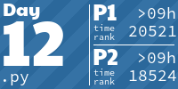
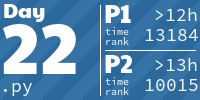
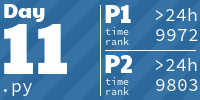

# Advent of Code

## How I get tasks

Thanks to [Advent Of Code to Markdown](https://github.com/antonio-ramadas/aoc-to-markdown).

```
SESSION_ID=$SESSION_ID python3 -m aoc_to_markdown -y $YEAR -d $DAY -o $YEAR -b main.py -i
```

## Stats

Thanks to [juliamarc](https://github.com/juliamarc) for idea and [based code](https://github.com/juliamarc/advent-of-code-2020/blob/main/stats.sh)

## AoC Tiles
[AoC Tiles](https://github.com/LiquidFun/aoc_tiles?tab=readme-ov-file)

<!-- AOC TILES BEGIN -->
<h1 align="center">
  Advent of Code - 356/450 ⭐
</h1>
<h1 align="center">
  2023 - 32 ⭐
</h1>
<a href="2023/day-01/main.py">
  
</a>
<a href="2023/day-02/main.py">
  
</a>
<a href="2023/day-03/main.py">
  
</a>
<a href="2023/day-04/main.py">
  
</a>
<a href="2023/day-05/main.py">
  
</a>
<a href="2023/day-06/main.py">
  
</a>
<a href="2023/day-07/main.py">
  
</a>
<a href="2023/day-08/main.py">
  
</a>
<a href="2023/day-09/main.py">
  
</a>
<a href="2023/day-10/main.py">
  
</a>
<a href="2023/day-11/main.py">
  
</a>
<a href="2023/day-12/main.py">
  
</a>
<a href="2023/day-13/main.py">
  
</a>
<a href="2023/day-14/main.py">
  
</a>
<a href="2023/day-15/main.py">
  
</a>
<a href="2023/day-16/main.py">
  
</a>
<h1 align="center">
  2022 - 42 ⭐
</h1>
<a href="2022/day-01/main.py">
  
</a>
<a href="2022/day-02/main.py">
  
</a>
<a href="2022/day-03/main.py">
  
</a>
<a href="2022/day-04/main.py">
  
</a>
<a href="2022/day-05/main.py">
  
</a>
<a href="2022/day-06/main.py">
  
</a>
<a href="2022/day-07/main.py">
  
</a>
<a href="2022/day-08/main.py">
  
</a>
<a href="2022/day-09/main.py">
  
</a>
<a href="2022/day-10/main.py">
  
</a>
<a href="2022/day-11/main.py">
  
</a>
<a href="2022/day-12/main.py">
  
</a>
<a href="2022/day-13/main.py">
  
</a>
<a href="2022/day-14/main.py">
  
</a>
<a href="2022/day-15/main.py">
  
</a>
<a href="2022/day-16/main.py">
  
</a>
<a href="2022/day-17/main.py">
  
</a>
<a href="2022/day-18/main.py">
  
</a>
<a href="2022/day-19/main.py">
  
</a>
<a href="2022/day-20/main.py">
  
</a>
<a href="2022/day-21/main.py">
  
</a>
<h1 align="center">
  2021 - 50 ⭐
</h1>
<a href="2021/day-01/main.py">
  
</a>
<a href="2021/day-02/main.py">
  
</a>
<a href="2021/day-03/main.py">
  
</a>
<a href="2021/day-04/main.py">
  
</a>
<a href="2021/day-05/main.py">
  
</a>
<a href="2021/day-06/main.py">
  
</a>
<a href="2021/day-07/main.py">
  
</a>
<a href="2021/day-08/main.py">
  
</a>
<a href="2021/day-09/main.py">
  
</a>
<a href="2021/day-10/main.py">
  
</a>
<a href="2021/day-11/main.py">
  
</a>
<a href="2021/day-12/main.py">
  
</a>
<a href="2021/day-13/main.py">
  
</a>
<a href="2021/day-14/main.py">
  
</a>
<a href="2021/day-15/main.py">
  
</a>
<a href="2021/day-16/main.py">
  
</a>
<a href="2021/day-17/main.py">
  
</a>
<a href="2021/day-18/main.py">
  
</a>
<a href="2021/day-19/main.py">
  
</a>
<a href="2021/day-20/main.py">
  
</a>
<a href="2021/day-21/main.py">
  
</a>
<a href="2021/day-22/main.py">
  
</a>
<a href="2021/day-23/main.py">
  
</a>
<a href="2021/day-24/main.py">
  
</a>
<a href="2021/day-25/main.py">
  
</a>
<h1 align="center">
  2020 - 50 ⭐
</h1>
<a href="2020/day-01/main.py">
  
</a>
<a href="2020/day-02/main.py">
  
</a>
<a href="2020/day-03/main.py">
  
</a>
<a href="2020/day-04/main.py">
  
</a>
<a href="2020/day-05/main.py">
  
</a>
<a href="2020/day-06/main.py">
  
</a>
<a href="2020/day-07/main.py">
  
</a>
<a href="2020/day-08/main.py">
  
</a>
<a href="2020/day-09/main.py">
  
</a>
<a href="2020/day-10/main.py">
  
</a>
<a href="2020/day-11/main.py">
  
</a>
<a href="2020/day-12/main.py">
  
</a>
<a href="2020/day-13/main.py">
  
</a>
<a href="2020/day-14/main.py">
  
</a>
<a href="2020/day-15/main.py">
  
</a>
<a href="2020/day-16/main.py">
  
</a>
<a href="2020/day-17/main.py">
  
</a>
<a href="2020/day-18/main.py">
  
</a>
<a href="2020/day-19/main.py">
  
</a>
<a href="2020/day-20/main.py">
  
</a>
<a href="2020/day-21/main.py">
  
</a>
<a href="2020/day-22/main.py">
  
</a>
<a href="2020/day-23/main.py">
  
</a>
<a href="2020/day-24/main.py">
  
</a>
<a href="2020/day-25/main.py">
  
</a>
<h1 align="center">
  2018 - 32 ⭐
</h1>
<a href="2018/day-01/main.py">
  
</a>
<a href="2018/day-02/main.py">
  
</a>
<a href="2018/day-03/main.py">
  
</a>
<a href="2018/day-04/main.py">
  
</a>
<a href="2018/day-05/main.py">
  
</a>
<a href="2018/day-06/main.py">
  
</a>
<a href="2018/day-07/main.py">
  
</a>
<a href="2018/day-08/main.py">
  
</a>
<a href="2018/day-09/main.py">
  
</a>
<a href="2018/day-10/main.py">
  
</a>
<a href="2018/day-11/main.py">
  
</a>
<a href="2018/day-12/main.py">
  
</a>
<a href="2018/day-13/main.py">
  
</a>
<a href="2018/day-14/main.py">
  
</a>
<a href="2018/day-15/main.py">
  
</a>
<a href="2018/day-16/main.py">
  
</a>
<h1 align="center">
  2017 - 50 ⭐
</h1>
<a href="2017/day-01/main.py">
  
</a>
<a href="2017/day-02/main.py">
  
</a>
<a href="2017/day-03/main.py">
  
</a>
<a href="2017/day-04/main.py">
  
</a>
<a href="2017/day-05/main.py">
  
</a>
<a href="2017/day-06/main.py">
  
</a>
<a href="2017/day-07/main.py">
  
</a>
<a href="2017/day-08/main.py">
  
</a>
<a href="2017/day-09/main.py">
  
</a>
<a href="2017/day-10/main.py">
  
</a>
<a href="2017/day-11/main.py">
  
</a>
<a href="2017/day-12/main.py">
  
</a>
<a href="2017/day-13/main.py">
  
</a>
<a href="2017/day-14/main.py">
  
</a>
<a href="2017/day-15/main.py">
  
</a>
<a href="2017/day-16/main.py">
  
</a>
<a href="2017/day-17/main.py">
  
</a>
<a href="2017/day-18/main.py">
  
</a>
<a href="2017/day-19/main.py">
  
</a>
<a href="2017/day-20/main.py">
  
</a>
<a href="2017/day-21/main.py">
  
</a>
<a href="2017/day-22/main.py">
  
</a>
<a href="2017/day-23/main.py">
  
</a>
<a href="2017/day-24/main.py">
  
</a>
<a href="2017/day-25/main.py">
  
</a>
<h1 align="center">
  2016 - 50 ⭐
</h1>
<a href="2016/day-01/main.py">
  
</a>
<a href="2016/day-02/main.py">
  
</a>
<a href="2016/day-03/main.py">
  
</a>
<a href="2016/day-04/main.py">
  
</a>
<a href="2016/day-05/main.py">
  
</a>
<a href="2016/day-06/main.py">
  
</a>
<a href="2016/day-07/main.py">
  
</a>
<a href="2016/day-08/main.py">
  
</a>
<a href="2016/day-09/main.py">
  
</a>
<a href="2016/day-10/main.py">
  
</a>
<a href="2016/day-11/main.py">
  
</a>
<a href="2016/day-12/main.py">
  
</a>
<a href="2016/day-13/main.py">
  
</a>
<a href="2016/day-14/main.py">
  
</a>
<a href="2016/day-15/main.py">
  
</a>
<a href="2016/day-16/main.py">
  
</a>
<a href="2016/day-17/main.py">
  
</a>
<a href="2016/day-18/main.py">
  
</a>
<a href="2016/day-19/main.py">
  
</a>
<a href="2016/day-20/main.py">
  
</a>
<a href="2016/day-21/main.py">
  
</a>
<a href="2016/day-22/main.py">
  
</a>
<a href="2016/day-23/main.py">
  
</a>
<a href="2016/day-24/main.py">
  
</a>
<a href="2016/day-25/main.py">
  
</a>
<h1 align="center">
  2015 - 50 ⭐
</h1>
<a href="2015/day-01/main.py">
  
</a>
<a href="2015/day-02/main.py">
  
</a>
<a href="2015/day-03/main.py">
  
</a>
<a href="2015/day-04/main.py">
  
</a>
<a href="2015/day-05/main.py">
  
</a>
<a href="2015/day-06/main.py">
  
</a>
<a href="2015/day-07/main.py">
  
</a>
<a href="2015/day-08/main.py">
  
</a>
<a href="2015/day-09/main.py">
  
</a>
<a href="2015/day-10/main.py">
  
</a>
<a href="2015/day-11/main.py">
  
</a>
<a href="2015/day-12/main.py">
  
</a>
<a href="2015/day-13/main.py">
  
</a>
<a href="2015/day-14/main.py">
  
</a>
<a href="2015/day-15/main.py">
  
</a>
<a href="2015/day-16/main.py">
  
</a>
<a href="2015/day-17/main.py">
  
</a>
<a href="2015/day-18/main.py">
  
</a>
<a href="2015/day-19/main.py">
  
</a>
<a href="2015/day-20/main.py">
  
</a>
<a href="2015/day-21/main.py">
  
</a>
<a href="2015/day-22/main.py">
  
</a>
<a href="2015/day-23/main.py">
  
</a>
<a href="2015/day-24/main.py">
  
</a>
<a href="2015/day-25/main.py">
  
</a>
<!-- AOC TILES END -->